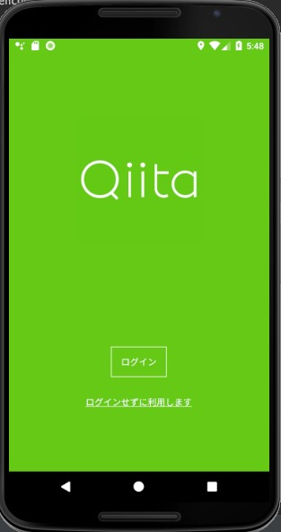
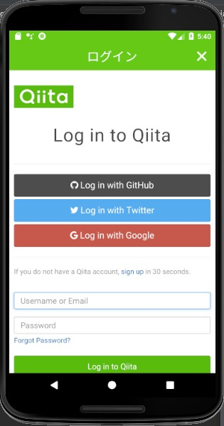
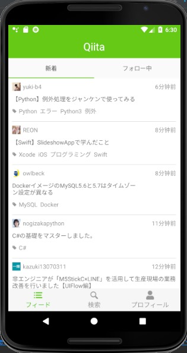
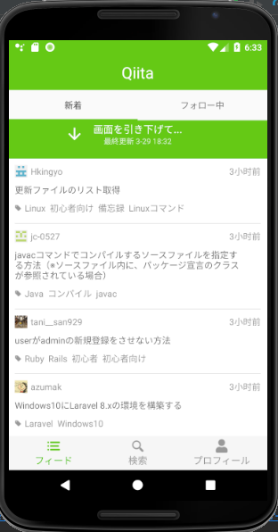
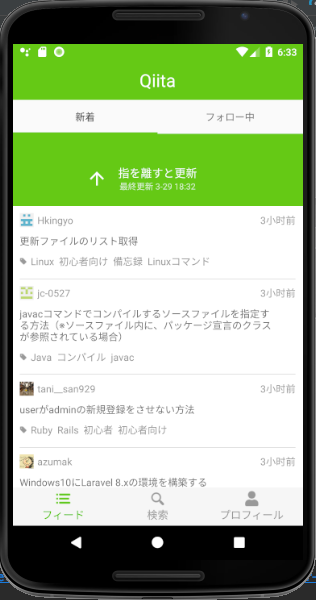
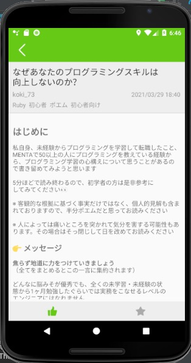
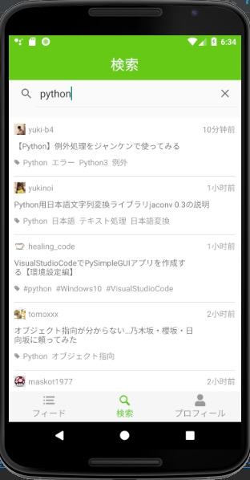
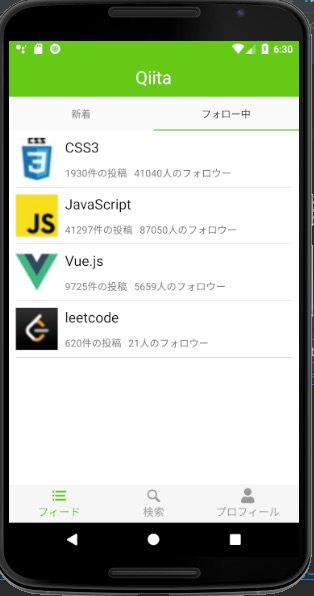

#### using [Qiita API v2](https://qiita.com/api/v2/docs)

#### landing page
 

#### login page
 

#### items page
 

#### refresh
 
 

#### article page
 

#### search page
 

#### following page
 
